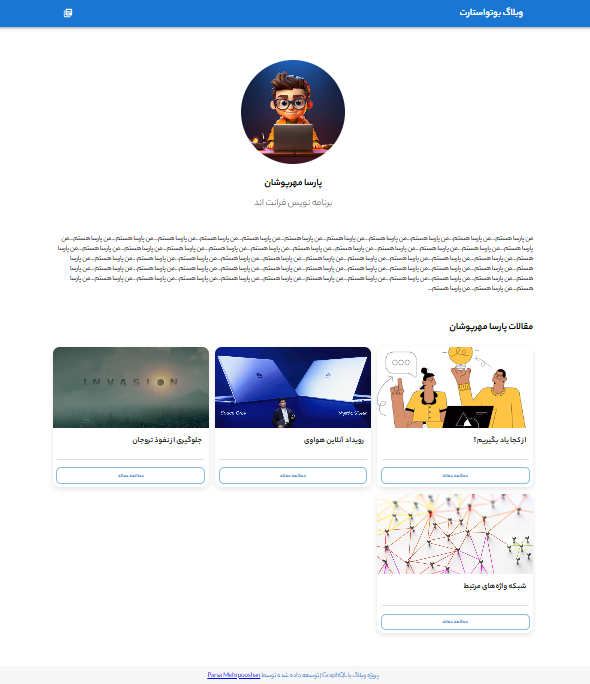

# Weblog | وبلاگ انتشار مقاله و تبادل نظر

## 📝 توضیح کوتاه پروژه

این پروژه یک وبلاگ است که کاربران می‌توانند مقالات منتشر شده توسط نویسندگان مختلف را مطالعه کنند. هر مقاله دارای صفحه اختصاصی با اطلاعات نویسنده و بخش تبادل نظرات است که امکان تعامل کاربران با محتوا را فراهم می‌کند. همچنین کاربران می‌توانند به صفحه هر نویسنده مراجعه کرده و اطلاعات نویسنده و سایر مقالات منتشرشده توسط او را مشاهده کنند.
این پروژه با استفاده از تکنولوژی‌های مدرن فرانت‌اند و بک‌اند پیاده‌سازی شده است.

هدف این پروژه، شبیه‌سازی یک سیستم واقعی وبلاگ با تمرکز بر تجربه کاربری، معماری تمیز و کدنویسی اصولی بوده است.

---

## 🖼 دمو پروژه

🎥 دموی آنلاین پروژه (در حال آماده‌سازی...)

📸 پیش‌ نمایش:





## 🚀 تکنولوژی‌ها و ابزارهای استفاده‌شده

### ⚙️ تکنولوژی‌ها

* HTML
* CSS
* JavaScript
* React.js
* Material UI
* Hygraph(GraphCMS)
* GraphQL Api
* React Router

---

## 🛠 روش نصب و اجرای پروژه

### 📥 نصب

1. کلون کردن ریپازیتوری:

```bash
git clone https://github.com/parsamehrpooshan/Weblog.git
```

2. نصب پکیج‌ها:

```bash
npm install
```

3. اجرای پروژه در حالت توسعه:

```bash
npm run dev
```

📍 سپس پروژه روی آدرس زیر در دسترس خواهد بود:

```
http://localhost:5173
```

---

## 🧪 ویژگی‌های اصلی پروژه

✨ قابلیت‌ها:

* مشاهده و مطالعه مقالات منتشرشده
* نمایش اطلاعات نویسنده هر مقاله
* امکان ویرایش اطلاعات شخصی
* صفحه اختصاصی نویسندگان همراه با مقالات مرتبط آن نویسندگان
* مدیریت داده‌ها و درخواست‌های API با GraphQL
* دریافت و نمایش داده‌ها با استفاده از GraphQL API
* مدیریت محتوا در پنل Hygraph(GraphCMS) و انتشار دیدگاه ها پس از تایید
* مسیریابی صفحات با React Router
* طراحی رابط کاربری مدرن و کاربرپسند با Material UI
* طراحی ریسپانسیو
---

## 📞 اطلاعات تماس

📩 ارتباط با من:

* Email: [parsamehrpooshan@gmail.com](mailto:example@gmail.com)

---

## ✅ نکات پایانی

* این پروژه مستمر آپدیت میشود و بیشتر ارتقا می‌یابد
* خوشحال می‌شوم اگر پیشنهاد یا بازخوردی برای بهبود پروژه داشتید به من اطلاع دهید🙌
* اگر پروژه را دوست داشتید، به ریپازیتوری استار بدید ⭐
